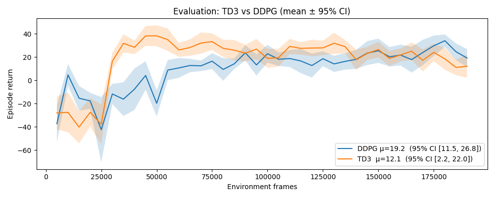
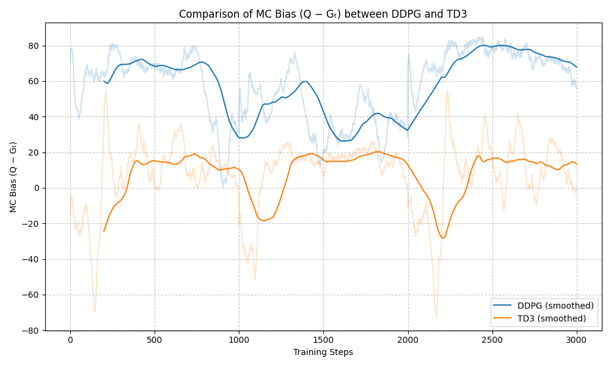

For the TorchRL implementation : TD3_DDPG_TRL.py, utils2.py
For the Stable Baseline 3 implementation : Stable Baseline 3/ddpg_sb3.py, Stable Baseline 3/td3_sb3.py

---

# DDPG vs. TD3

This project implements and compares **DDPG** and **TD3**  both trained on the LunarLanderContinuous-v3 environment using **TorchRL**.
Additionally, a parallel implementation using **Stable Baselines3** was explored too.  


---


## Training Setup

| Hyperparameter | Value |
|----------------|--------|
| Environment | LunarLanderContinuous-v3 |
| Total frames | 100,000 |
| Batch size | 128 |
| Replay buffer size | 1,000,000 |
| Actor learning rate | 2e-4 |
| Critic learning rate | 2e-4 |
| Discount factor (γ) | 0.99 |
| Target update rate (τ) | 0.01 |
| Evaluation frequency | Every 10,000 frames |
| Evaluation episodes | 10 |

---

## Evaluation Metrics

### 1. **Return Plot (Performance Curve)**

The **return plot** shows the **mean episodic return** (total reward per episode) across training, evaluated every 10,000 frames.  
The shaded region represents the **95% confidence interval** (CI) over evaluation episodes.

**Example:**
<p align="center">
  
</p>

---

### 2. **Bias Plot (Q - Monte Carlo Return)**

The **bias plot** measures the average difference between:
**Bias** = Q(s, a) − Gₜ
where Gₜ is the Monte Carlo return computed from rollouts.

**Example:**
<p align="center">
  
</p>

Interpretation:
- DDPG tends to **overestimate Q-values**, leading to unstable updates and poor policy gradients but TD3 significantly **reduces the bias** thanks to its use of **clipped double Q-learning**.

---
### **Install dependencies**

For the training and evaluation please run :

```bash
python TD3_DDPG_TRL.py --method DDPG
```


---

## Results and CSV Files

After training, evaluation results are automatically saved:

| File | Description |
|------|--------------|
| `DDPG_retruns_eval_results.csv` | Mean return and CI for DDPG |
| `TD3_retruns_eval_results.csv` | Mean return and CI for TD3 |

